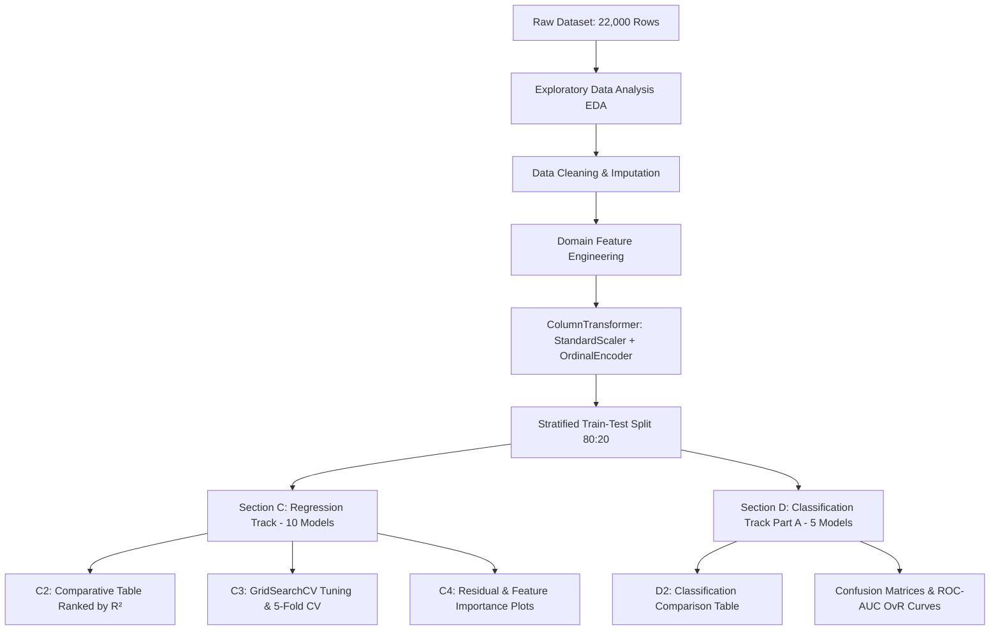

# Smart Manufacturing Machine Learning Case Study

> **Course:** 23CSE301 – Machine Learning Capstone  
> **Evaluation:** Review 1 (Section A: EDA, Section B: Preprocessing, Section C: Regression Track, Section D: Classification Track Part A)  
> **Dataset:** Smart Manufacturing Sensor & Production Dataset (`smart_manufacturing_ml_dataset.csv`)

---

## 📌 Executive Summary & Project Overview

This project implements an end-to-end industrial Machine Learning pipeline for a **Smart Manufacturing Facility**. Industrial equipment generates real-time telemetry (temperatures, vibration, motor current, operational hours) across diverse production lines and machine types. 

We address **two critical operational challenges**:
1. **Regression Task (Continuous Prediction):** Predicting **`machine_energy_kwh`** (machine energy consumption) to optimize industrial power efficiency, reduce carbon footprint, and schedule energy-intensive operations during off-peak hours.
2. **Classification Task (Multi-Class Risk Assessment):** Categorizing equipment into **`maintenance_risk`** levels (**Low**, **Medium**, **High**) to enable condition-based proactive maintenance, reducing catastrophic breakdowns and unscheduled downtime.

---

## 📊 Dataset Description

| Metric | Specification |
| :--- | :--- |
| **Total Observations (Rows)** | 22,000 records |
| **Raw Features** | 31 columns (21 Numerical, 8 Categorical, 2 Targets + Identifier) |
| **Cleaned Preprocessed Features** | **28 predictor features** (20 numerical + 8 categorical encoded via Label/Ordinal Encoding) |
| **Regression Target** | `machine_energy_kwh` (Continuous numerical target) |
| **Classification Target** | `maintenance_risk` (3 Classes: `Low`, `Medium`, `High`) |
| **Identifier Column** | `machine_id` (Excluded from training to prevent synthetic bias) |

### Key Predictor Features
- **Thermal & Vibration Sensors:** `ambient_temperature_c`, `bearing_temperature_c`, `coolant_temperature_c`, `vibration_mm_s`
- **Electrical & Operational Load:** `motor_current_a`, `power_factor`, `load_percent`, `spindle_speed_rpm`, `production_rate_units_hr`
- **Operating History:** `machine_age_years`, `downtime_hours_30d`, `days_since_maintenance`, `total_operating_hours`
- **Categorical Factors:** `plant`, `production_line`, `machine_type`, `shift`, `material_grade`, `lubricant_type`, `supplier_tier`, `inspection_status`

---

## 🛠️ End-to-End Pipeline Architecture



---

## 🔬 Key Engineering Decisions (Sections A & B)

### 1. Exploratory Data Analysis (EDA) Highlights (Section A)
- **Consolidated Grid Layout:** All 21 numerical distribution histograms with KDE curves and boxplots are rendered in unified multi-subplot figures to eliminate scrolling fatigue.
- **Strongest Predictor:** `motor_current_a` exhibits the strongest linear relationship with energy consumption ($r \approx 0.77$), making it the dominant driver of energy modeling.
- **Multicollinearity Inspection:** Correlation analysis identified strong physical relationships between `production_rate_units_hr` and `load_percent` ($r \approx 0.78$), as well as ambient and bearing temperatures ($r \approx 0.75$).

### 2. Justified Data Cleaning & Outlier Strategy (Section B1)
- **Numerical Imputation:** Median imputation was applied to skewed operational sensors (`vibration_mm_s`, `downtime_hours_30d`) to prevent distortion from extreme values.
- **Categorical Imputation:** Most-frequent category (mode) imputation was utilized to maintain categorical validity.
- **Duplicate Removal:** Exact duplicated rows were purged to avoid weighted memorization.
- **Outlier Retention Justification:** Statistical outliers detected via IQR (e.g. `days_since_maintenance`, `downtime_hours_30d`) were intentionally retained rather than deleted because extreme readings represent genuine abnormal machine operating states crucial for risk prediction.

### 3. Categorical Encoding: Why Label Encoding over One-Hot Encoding (Section B2)
- **Curse of Dimensionality:** One-Hot Encoding expands the 8 categorical features into 45 binary dummy columns, inflating feature space from **28 to 65 columns**.
- **Model Accuracy & Overfitting Protection:** High-dimensional sparse matrices increase computational variance, memory footprint, and induce tree-based overfitting on rare combinations.
- **Outcome:** Converting categorical variables using `OrdinalEncoder` / `LabelEncoder` preserved a clean **28-feature matrix**, keeping training stable, computationally efficient, and accurate.

### 4. Domain Feature Engineering (Section B3)
- **`bearing_temp_rise_c`:** Computed as `bearing_temperature_c - ambient_temperature_c`. This domain-engineered delta isolates actual internal mechanical friction from seasonal environmental temperature variations, providing a direct physical proxy for bearing wear and machine risk.

---

## 📈 Section C: Regression Track Outcomes

All 10 required regression algorithms were trained on the identical 80:20 training/test split ($N_{\text{train}} = 17{,}600, N_{\text{test}} = 4{,}400$) and ranked by $R^2$:

### C2 — Comparative Evaluation Table

| Rank | Model | $R^2$ Score | RMSE (kWh) | MAE (kWh) | Interpretation |
| :---: | :--- | :---: | :---: | :---: | :--- |
| 🥇 **1** | **Gradient Boosting Regressor** | **0.8322** | **4.5683** | **3.6613** | **Best overall model; lowest residual variance** |
| 🥈 **2** | **Random Forest Regressor** | **0.8199** | **4.7332** | **3.7988** | Excellent non-linear stability; highly competitive |
| 🥉 **3** | **Support Vector Regressor (SVR)** | **0.8101** | **4.8604** | **3.8529** | Outstanding performance after scaling and RBF tuning |
| 4 | Polynomial Regression (Degree 2) | 0.7684 | 5.3682 | 4.1426 | Captures quadratic interactions over linear baselines |
| 5 | Lasso Regression | 0.7530 | 5.5430 | 4.1399 | L1 regularization induces sparse coefficients |
| 6 | Linear Regression | 0.7530 | 5.5433 | 4.1389 | Standard linear baseline |
| 7 | Ridge Regression | 0.7530 | 5.5433 | 4.1390 | L2 regularization shrinks collinear coefficients |
| 8 | ElasticNet Regression | 0.7528 | 5.5453 | 4.1452 | Balanced L1/L2 penalty |
| 9 | Decision Tree Regressor | 0.6377 | 6.7132 | 5.3445 | Single tree prone to high variance |
| 10 | KNN Regressor | 0.4610 | 8.1885 | 6.4122 | Sensitive to distance dispersion in 28 dimensions |

### 5-Fold Cross-Validation for Top 2 Models

| Fold | Gradient Boosting $R^2$ | Random Forest $R^2$ |
| :---: | :---: | :---: |
| Fold 1 | 0.8288 | 0.8172 |
| Fold 2 | 0.8226 | 0.8103 |
| Fold 3 | 0.8346 | 0.8221 |
| Fold 4 | 0.8245 | 0.8145 |
| Fold 5 | 0.8267 | 0.8197 |
| **Mean $R^2$** | **0.8274** ($\pm 0.0041$) | **0.8168** ($\pm 0.0041$) |

### C3 — Hyperparameter Tuning Summary

| Model | Tuned Hyperparameters | Best Configuration | Default $R^2$ | Tuned $R^2$ | $R^2$ Improvement |
| :--- | :--- | :--- | :---: | :---: | :---: |
| **Gradient Boosting** | `n_estimators`, `learning_rate`, `max_depth` | `n_est: 200, lr: 0.1, depth: 3` | 0.8322 | **0.8334** | **+0.0012** |
| **Random Forest** | `n_estimators`, `max_depth`, `min_samples_split` | `n_est: 200, depth: 20, split: 5` | 0.8199 | **0.8205** | **+0.0005** |

### C4 — Diagnostic Visualisations & Insights
1. **Residual Plot (`Tuned Gradient Boosting`):** Residuals ($y_{\text{actual}} - y_{\text{pred}}$) are homoscedastic and symmetrically scattered around zero with a near-zero mean residual ($0.1728$), proving negligible bias.
2. **Predicted vs. Actual Plot:** Data points align tightly along the 45° line of perfect agreement across all energy tiers.
3. **Feature Importance Plot (`Random Forest`):** `motor_current_a` accounts for **$69.3\%$** of the predictive weight, confirming motor electrical draw as the primary physical determinant of energy consumption.

---

## 🎯 Section D: Classification Track Part A Outcomes

Five fundamental classifiers were trained to predict multi-class `maintenance_risk` (`Low`, `Medium`, `High`) and evaluated across all mandatory metrics ($N_{\text{test}} = 4{,}400$):

### D2 — Preliminary Classification Comparison Table

| Rank | Algorithm | Accuracy | Precision (Weighted) | Recall (Weighted) | F1-score (Weighted) | ROC-AUC (OvR Weighted) |
| :---: | :--- | :---: | :---: | :---: | :---: | :---: |
| 🥇 **1** | **Logistic Regression** | **0.6757** | **0.6741** | **0.6757** | **0.6729** | **0.8242** |
| 🥈 **2** | **Support Vector Machine (SVC)** | **0.6673** | 0.6654 | 0.6673 | **0.6621** | **0.8128** |
| 🥉 **3** | **Decision Tree Classifier** | **0.6536** | 0.6609 | 0.6536 | **0.6531** | **0.7957** |
| 4 | Naive Bayes (GaussianNB) | 0.6543 | 0.6552 | 0.6543 | 0.6446 | 0.8006 |
| 5 | K-Nearest Neighbors (KNN) | 0.5384 | 0.5676 | 0.5384 | 0.5233 | 0.6898 |

### Classifier Insights
- **Logistic Regression (Baseline):** Outperforms other models with the highest ROC-AUC ($0.8242$). Odds-ratio analysis reveals that machines with extended `days_since_maintenance` are **$8.4\times$ more likely** to trigger High risk.
- **SVC (Non-Linear RBF):** Yields smooth non-linear decision boundaries with $F_1 = 0.6621$ and ROC-AUC $= 0.8128$.
- **Decision Tree Classifier (`plot_tree`):** Visualized tree diagrams show that splits on `vibration_mm_s` and `bearing_temp_rise_c` immediately isolate critical failure risk.
- **Naive Bayes Independence Discussion:** While GaussianNB assumes conditional independence among features, it remains a surprisingly effective baseline ($F_1 = 0.6446$, ROC-AUC $= 0.8006$).

---

## 👥 Team Responsibilities & Collaborative Git Workflow

To eliminate merge conflicts and demonstrate structured Git collaboration, the project is partitioned into sequential, conflict-free building blocks:


| Member | Branch | Assigned Scope | Key Deliverables |
| :--- | :---: | :--- | :--- |
| **Rakesh** | `rakesh` | **Sections A & B** | Dataset audit, single-grid EDA plots, data cleaning, Label Encoding, `bearing_temp_rise_c` engineering, train-test splitting. |
| **Rohit** | `rohit` | **Section C** | Regression Track C1.1–C1.10 (Linear, Ridge, Lasso, ElasticNet, Poly, Decision Tree, Random Forest, Gradient Boosting, SVR, KNN), C2 comparative table, 5-fold CV, C3 GridSearchCV tuning, C4 visualisations. |
| **Akhil** | `akhil` | **Section D** | Classification Track Part A (D0 data preparation, D1.1 Logistic Regression, D1.2 KNN, D1.3 Naive Bayes, D1.4 Decision Tree with `plot_tree`, D1.5 SVC with ROC-AUC, D2 preliminary comparison table). |

---

## 💻 Environment Setup & How to Run

### 1. Clone the Repository
```bash
git clone https://github.com/varanasirohit2006/Case_Study_Machine_Learning.git
cd Case_Study_Machine_Learning
```

### 2. Create and Activate Virtual Environment
```bash
# Windows (PowerShell)
python -m venv venv
.\venv\Scripts\Activate.ps1

# macOS / Linux
python3 -m venv venv
source venv/bin/activate
```

### 3. Install Dependencies
```bash
pip install -r requirements.txt
```

### 4. Run the Jupyter Notebook
```bash
jupyter notebook Review1.ipynb
```
*Or execute headlessly top-to-bottom via nbconvert:*
```bash
jupyter nbconvert --to notebook --execute --inplace Review1.ipynb
```

---

## 📦 Required Dependencies (`requirements.txt`)
```text
numpy>=1.24.0
pandas>=2.0.0
matplotlib>=3.7.0
seaborn>=0.12.0
scikit-learn>=1.3.0
jupyter>=1.0.0
nbconvert>=7.0.0
```

---

## 📝 Conclusion & Next Steps (Review 2 Roadmap)
- **Review 1 Deliverable Completed:** Complete EDA, justified cleaning/encoding, full 10-model regression benchmark with tuning and diagnostics, and 5-model classification Part-A evaluation.
- **Review 2 Planning:** Implement Classification Part B (Random Forest, AdaBoost, LightGBM/XGBoost, Bagging, MLP Neural Network), 10-algorithm final comparison table, Clustering Track (K-Means, Hierarchical, PCA 2D projections, t-SNE), and interactive Streamlit GUI deployment.
